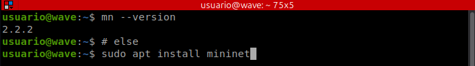

# WAVE - Multiple load generator for computer network experimentation

Experimentation is fundamental in computer networks research, especially for validating hypotheses in controlled scenarios. In this context, this work presents a new version of WAVE (Workload Assay for Verified Experiments) integrated with Mininet, a widely used network emulator. This integration allows researchers to have greater control over the network environment where the generated traffic will be evaluated, enabling the configuration of network characteristics such as delay and packet loss. Currently, WAVE supports the linear and tree topologies, which are configured through user-defined parameters, allowing greater flexibility in the creation of experimental scenarios.

##  README Structure

- **Seals Considered**: describes the artifact evaluation criteria.
- **Project information**: useful links, including user manual, previous work, and demonstration videos.
- **Basic information**: presents the hardware and software requirements needed for execution.
- **Dependencies**: lists the tools and libraries used.
- **Installation and running**: describes how to configure and start the environment.
- **Security concerns**: describes potential risks and safe execution practices.
- **Minimum Test**: presents a simple scenario to validate the installation.
- **Ending the WAVE Execution**: describes how to properly terminate the environment.

## Seals Considered

The seals considered for this artifact are:

- **Available**
- **Functional**
- **Reproducible**

## Project information

This section provides useful resources related to the WAVE tool, including documentation, previous publications, and demonstration videos.

[WAVE User Manual](WAVE_User_Manual.pdf)

[Salão de Ferramentas SBRC 2025 (previous work)](https://doi.org/10.5753/sbrc_estendido.2025.6301)

[Demonstrative videos of the WAVE tool](https://drive.google.com/drive/folders/1E3_Gj1HX8jhLEx9tRARIDYxlm8bzkNN3?usp=drive_link)

## Basic information

- CPU: 4 cores or higher
- Memory: at least 8 GB RAM
- Storage: at least 10 GB of free space

### Operating System

WAVE has been tested on Linux-based systems, especially:

- Ubuntu 22.04 or higher

### Environment Overview

WAVE integrates multiple technologies for network experimentation:

- Docker containers for service orchestration
- Mininet for network emulation
- Grafana for metrics visualization
- Vagrant and VirtualBox for optional virtual machine provisioning

## Dependencies

To run WAVE, the following dependencies are required:

- **Python 3** (version 3.11 or higher)
- **Virtualenv** (version 3.11 or higher)
- **Docker** (version 27.x or higher)
- **Docker Compose** (version 2.32.x or higher)
- **Mininet** (installation via the official website is recommended)
- **VirtualBox** (version 7.1.6 or higher)
- **Vagrant** (version 2.3.4 or higher)

## Security concerns

WAVE uses technologies that may impact the host system, such as Docker and Mininet.

- Mininet may modify system network configurations.
- Docker may run with elevated privileges depending on the configuration.

### Recommendations

- Avoid running in production environments
- Ensure the user has appropriate permissions
- Monitor CPU and memory usage during experiments

No critical risks were identified, provided that the best practices above are followed.

## Checking the Required Requirements

### Checking if Python3 is installed and it's version:

<!--  -->

```
python3 --version
```
If it is not installed:

```
sudo apt update && sudo apt install python3
```

### Additionally, the VirtualEnv virtual environment is required:

<!--  -->

```
sudo apt list | grep python3-venv
```
If it is not installed:

```
sudo apt update && sudo apt install python3-venv
```

### Checking the Docker and docker compose components:

<!-- 

] -->


```
docker --version
docker compose version
```
If it is not installed:

Install curl if you don't already have it.

```
sudo apt install -y curl
```

```
curl -fsSL https://get.docker.com -o get-docker.sh
chmod +x get-docker.sh 
sudo sh ./get-docker.sh
```
After installation, you may need to configure permissions and add your user to the docker group.

### Checking what version of Virtualbox is installed:

<!--  -->

```
vboxmanage --version
```

If it is not installed:

```
sudo apt install virtualbox
```
If VirtualBox is not available in the repository, install it from the [official website](https://www.virtualbox.org/wiki/Linux_Downloads).

### Checking what version of Vagrant is installed:

<!--  -->

```
vagrant --version
```

If it is not installed:

Manual installation of Vagrant from the [official website](https://developer.hashicorp.com/vagrant/install#linux).
```
wget -O - https://apt.releases.hashicorp.com/gpg | sudo gpg --dearmor -o /usr/share/keyrings/hashicorp-archive-keyring.gpg
echo "deb [arch=$(dpkg --print-architecture) signed-by=/usr/share/keyrings/hashicorp-archive-keyring.gpg] https://apt.releases.hashicorp.com $(grep -oP '(?<=UBUNTU_CODENAME=).*' /etc/os-release || lsb_release -cs) main" | sudo tee /etc/apt/sources.list.d/hashicorp.list
sudo apt update && sudo apt install vagrant

```

### Checking what version of Mininet is installed

<!--  -->

```
mn --version
```

If it is not installed:

```
sudo apt update && sudo apt install mininet
```

We recommend installing Mininet from the official website, as it provides the most up-to-date version:  
https://mininet.org/download/

Although Mininet can also be installed using `apt install mininet`, the version available in the distribution repositories may not be the most recent one.


The versions shown in the figures were those tested at the time of this manual's creation.

## Running

### Cloning the official repository and starting the system:

```
git clone https://github.com/1valcl3b/last_wave.git
cd last_wave/wave
./app-compose.sh --start
```

### Checking the execution in a Docker environment:


As can be seen in the figure above, the WAVE Initialization module uses two containers for its execution: wave_app and grafana-oss. On the left side of the figure, we have the output of the WAVE startup command.

### The WAVE Web module can be accessed via a browser. We recommend using Google Chrome or another Chromium-based browser for better compatibility.


The form contains fields for entering network data for both the traffic load source and destination. In addition to specifying the IP address, the user can choose how the environment will be provisioned, either through a container or a virtual machine, with configurable memory size and number of virtual CPUs. It is also possible to configure the network topology through user-defined parameters. Currently, the WAVE supports linear and tree topologies. Finally, the user can select which workload model to apply, such as sinusoid, flashcrowd, or step, and optionally enable the use of micro-burst traffic.

## Minimum Test

This test aims to validate whether the environment has been correctly configured.

### Procedure

1. Clone the repository:

```
git clone https://github.com/1valcl3b/last_wave.git
cd last_wave/wave
```

2. Start the environment:

```
./app-compose.sh --start
```

3. Verify that the containers are running:

```
docker ps
```

It is expected that the containers `wave_app`, `node-exporter`, and `grafana-oss` are active.

4. Access the web interface in the browser (use Chrome or Brave):

```
http://localhost
```

5. Configure a simple experiment:

- Platform: VM
- Topology: Linear
- Number of switches: 5
- Workload model: stair step

6. Execute the experiment.

7. Return to the terminal to enter the root password (Mininet requires root privileges; you can configure the visudo file to avoid password prompts)

8. After entering the password, you may return to the web interface

### Expected result

- The environment will be provisioned (this may take some time)
- The results web interface should appear
- Metrics should be visualized through charts

If all steps are completed successfully, the environment is ready for use. If any issues are encountered while starting or terminating the environment, we recommend consulting the demonstration videos available in the Project Information section. In particular, the first video provides a complete walkthrough of the tool execution.

### Ending the WAVE Execution

Finalizing and removing the container environment:

```
./app-compose.sh --destroy
```

By running the command above, the user terminates the WAVE WEB module and removes the containers responsible for the other initiated modules. To restart the entire system, simply execute the same command, replacing the --destroy argument with --start.

## Experiments

This section describes how to reproduce one of the main claims presented in the paper: **WAVE can dynamically configure Mininet network parameters and reproduce their impact on network metrics such as RTT.**

The experiment reproduces the delay analysis scenario presented in the **“Impact of Mininet Parameters”** section of the paper, where different delay values are injected into the network topology to evaluate their impact on Round-Trip Time (RTT).

The goal of this experiment is to demonstrate that increasing the configured delay in Mininet produces a proportional increase in RTT while maintaining stable and reproducible network behavior across executions.

### Experiment Configuration

Start the WAVE environment:

```bash
./app-compose.sh --start
```
Access the Web interface:
```
http://localhost
```
Use the following base configuration:

- Platform: VM
- Topology: Linear, Number of switches: 5
- Workload model: Stair Step, Interval: 5, Jump: 10, Duration: 10

### Scenario 1: Baseline

Configure:

- Delay: 0 ms

Execute the experiment.

Expected result:

- The environment should be provisioned successfully
- The Analysis Result screen should be displayed
- A higher Mbps rate should be observed arriving at the server interface

Expected execution time:

- Approximately 3–5 minutes

### Scenario 2: Delay Injection (10 ms)

Configure:

- Delay: 10 ms

Execute the experiment.

Expected result:

- The Analysis Result screen should be displayed
- Traffic should continue reaching the server interface
- The observed Mbps rate should be lower than the baseline scenario

- Expected execution time:

Approximately 3–5 minutes

### Scenario 3: Delay Injection (50 ms)

Configure:

- Delay: 50 ms

Execute the experiment.

Expected result:

- The Analysis Result screen should be displayed
- Traffic should continue reaching the server interface
- The observed Mbps rate should be lower than the 10 ms scenario

Expected execution time:

- Approximately 3–5 minutes

## Expected Result

In all scenarios, the **Analysis Results** screen should display:

- Traffic arriving at the server network interface
- CPU usage
- Memory usage

The expected behavior is that, as the configured delay increases, the amount of Mbps reaching the server interface decreases proportionally.

This demonstrates that WAVE correctly applies Mininet delay parameters in a reproducible experimental environment.

## LICENSE

This project is licensed under the GNU General Public License v3.0 (GPL-3.0). See the LICENSE file for more details.
